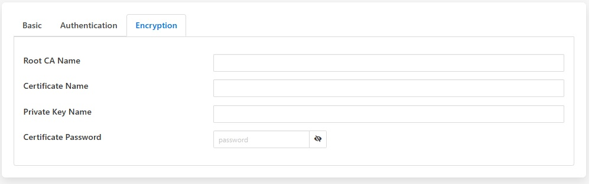

.. Images
.. |kafka_1| image:: images/kafka_1.jpg
.. |kafka_2| image:: images/kafka_2.jpg

Kafka Producer
==============

The *fledge-north-kafka* plugin sends data from Fledge to the an Apache Kafka. Fledge acts as a Kafka producer, sending reading data to Kafka. This implementation is a simplified producer that sends all data on a single Kafka topic. Each message contains an asset name, timestamp and set of readings values as a JSON document.

The configuration of the *Kafka* plugin is very simple, consisting of four parameters that must be set.

+-----------+
| |kafka_1| |
+-----------+

  - **Bootstrap Brokers**: A comma separate list of Kafka brokers to use to establish a connection to the Kafka system.

  - **Kafka Topic**: The Kafka topic to which all data is sent.

  - **Send JSON**: This controls how JSON data points should be sent to Kafka. These may be sent as strings or as JSON objects.

  - **Compression Type**: Type of compression codec to be used before sending data to kafka broker. Supported compression types are gzip, snappy and lz4. Default value is none.

  - **Data Source**: Which Fledge data to send to Kafka; Readings or Fledge Statistics.

+-----------+
| |kafka_2| |
+-----------+

  - **Security Protocol**: Security protocol to be used to connect to the kafka broker.

  - **SASL Mechanism**: Authentication mechanism to be used to connect to kafka broker. Only PLAIN mechanism is supported as of now, support for other authentication mechanism will be added soon

  - **User ID**: The User ID to use when the Mechansim is set to SASL_PLAINTEXT or SASL_SSL.

  - **Password**: The Password to use when the Mechansim is set to SASL_PLAINTEXT or SASL_SSL.

+-----------+
| |kafka_3| |
+-----------+

  - **Root CA Name**: Name of the root certificate authority that will be used to verify the certificate.

  - **Certificate Name**: Name of client certificate for identity authentications.

  - **Private Key Name**: Name of client private key required for communication.

  - **Certificate Password**: Optional: Password to be used when loading the certificate chain.

All the certificates must be added to the certificate store within Fledge.

==========================
Sending To Azure Event Hub
==========================

The Kafka plugin can be used to send data to the Azure Event Hub, configured with Shared Access Signature (SAS); This will require the following configuration settings,

  - **Bootstrap Brokers**: Azure event hub endpoint
  - **Topic**: Azure event hub name
  - **Security Protocol**: SASL_SSL
  - **SASL Mechanism**: PLAIN
  - **User ID**: $ConnectionString
  - **SSL Certificate Password**:  Must be set blank

.. |location_link| raw:: html

  <a href="https://learn.microsoft.com/en-us/azure/event-hubs/azure-event-hubs-kafka-overview#shared-access-signature-sas" target="_blank">Azure event hub kafka overview</a>

|location_link|
