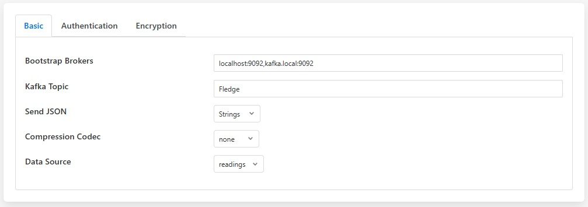
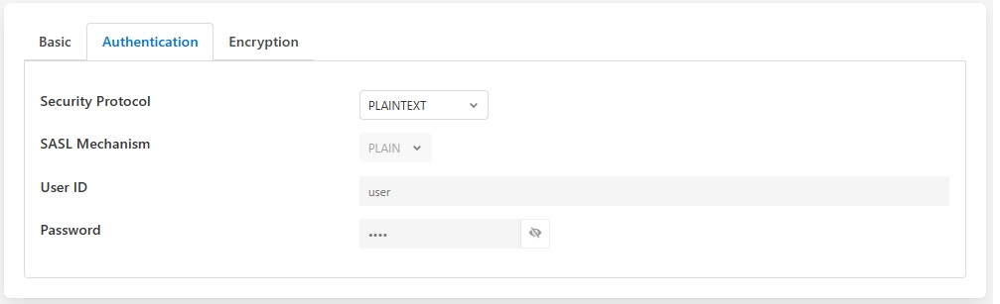

.. Images

.. |kafka_3| image:: images/kafka_3.jpg

Kafka Producer
==============

The *fledge-north-kafka* plugin sends data from Fledge to the an Apache Kafka. Fledge acts as a Kafka producer, sending reading data to Kafka. This implementation is a simplified producer that sends all data on a single Kafka topic. Each message contains an asset name, timestamp and set of readings values as a JSON document.

The configuration of the *Kafka* plugin is very simple, consisting of four parameters that must be set.

+-----------+
| |kafka_1| |
+-----------+

  - **Bootstrap Brokers**: A comma separate list of Kafka brokers to use to establish a connection to the Kafka system.

  - **Kafka Topic**: The Kafka topic to which all data is sent.

  - **Send JSON**: This controls how JSON data points should be sent to Kafka. These may be sent as strings or as JSON objects.

  - **Data Source**: Which Fledge data to send to Kafka; Readings or Fledge Statistics.

+-----------+
| |kafka_2| |
+-----------+

  - **Kafka Security Protocol**: Security protocol to be used to connect with kafka broker.

  - **Kafka SASL Mechanism**: SASL Mechanism. Only PLAIN mechanism is supported, support for other will be added soon

  - **Kafka User ID**: User ID to be used with SASL_PLAINTEXT and SASL_SSL.

  - **Kafka Password**: Password to be used with SASL_PLAINTEXT and SASL_SSL.

+-----------+
| |kafka_2| |
+-----------+

  - **Root CA Name**: Name of Root CA to use in certificate verification.

  - **Certificate Name**: Name of client certificate for identity authentications.

  - **Private Key Name**: Name of client private key required for communication.

  - **SSL Certificate Password**: Optional: Password to be used when loading the certificate chain.

All the certificates must be added into the certificate store of the Fledge

